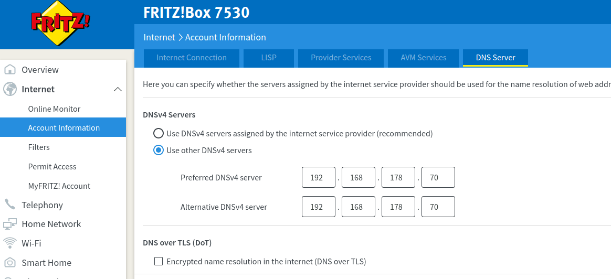
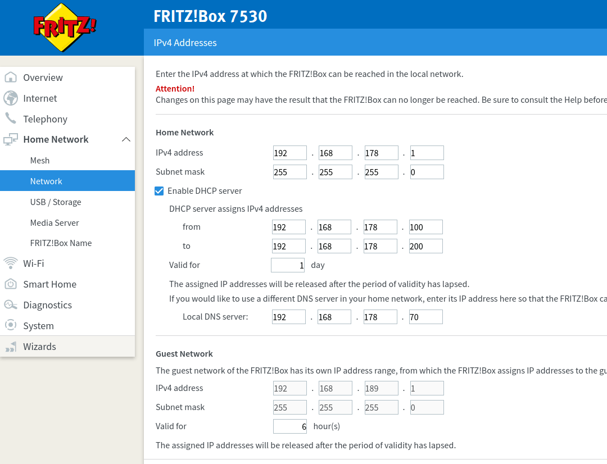

**This is an unsupported configuration created by the community**

This guide was developed using FRITZ!OS 07.21 but should work for others too. It aims to line out a few basic prinicples to have a seemless DNS experience with Pihole and Fritz!Boxes .

> Note:
There is no single way to do it right. Choose the one best fitting your needs.
This guide is IPv4 only. You need to adjust for IPv6 accordingly

## 1) Using Pihole as upstream DNS server for your Fritz!Box

Using this configuration, Pihole is used for all devices within your network including the Fritz!Box itself. DNS requests are send in this order

```bash
Client -> Fritz!Box -> Pihole -> Upstream DNS Server
```

To set it up, enter Pihole's IP as "Preferred DNS server" **and** "Alternative DNS server" in

```bash
Internet/Account Information/DNS server
```
 

!!! warning
    Don't set the Fitz!Box as upstrem DNS server for pihole! This will lead to a DNS loop as the Pihole will send the queries to the Fritz!Box which in turn will send the to Pihole.

With this configuration, you won't see individual clients in pihole's dashboard. For pihole, all queries will appear as if they are comming from your Fritz!Box. You will therefore miss out some features, e.g. Group Management. This can be solved using method #2.


## 2) Distribute Pihole as DNS server via DHCP

Using this configuration, all clients will get Pihole's IP offered as DNS server when they request a DHCP lease from your Fritz!Box.
DNS requests are send in this order

```bash
Client -> Pihole -> Upstream DNS Server
```

> Note:
The Fritz!Box itself will use whatever is configured in Internet/Account Information/DNS server.
The Fritz!Box can be Pihole's upstream DNS server, as long Pihole itself is not the the upstream server for the Fritz!Box. This would  cause a DNS loop.

To set it up, enter Pihole's IP as "Local DNS server" in

```bash
Home Network/Network/Network Settings/IP Adresses/IPv4 Configuration/Home Network
```
 

>Note:
Clients will notice changes in DHCP settings only after they acquire a new DHCP lease. The easiest way to force a renewal is to dis/reconnect the client from the network.

You should see individual clients in Pihole's web dashboard.

## 3) Combining 1) and 2)

You can combine 1) and 2) which will let all clients  send DNS requests to your Pihole **and** the Fritz!Box itself as well.

```bash
Client (incl. Fritz!Box) -> Pihole -> Upstream DNS Server
```

!!! warning
    Don't set the Fritz!Box as upstrem DNS server for pihole! This will lead to a DNS loop as the Pihole will send the queries to the Fritz!Box which in turn will send the to Pihole

## Using Pihole within the Guest Network

You may have noticed, that there is no option to set the DNS server for the guest network in

```bash
Home Network/Network/Network Settings/IP Adresses/IPv4 Configuration/Guest Network
```

The Fritz!Box always set its own IP as DNS server for  the guest network. To filter its traffic, you have to setup Pihole as upstream DNS server for your Fritz!Box (see #1). As there is no other option, all DNS requests from your guest network will appear as coming from your Fritz!Box.
