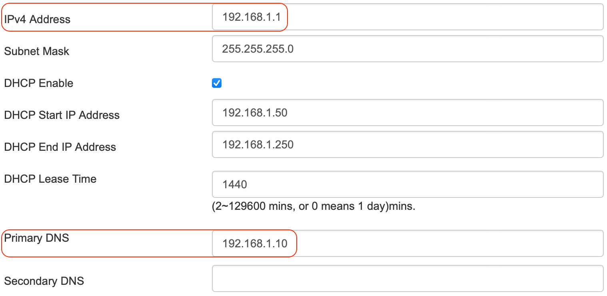
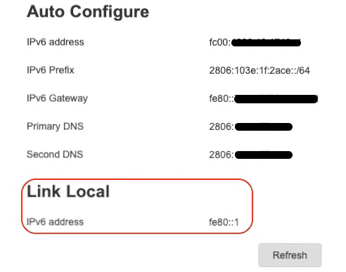

This guide was developed using a `Nokia G-240W-B` router (software version 3FE47969AGCA21). It should work for other models in the `G` series.

!!! note
There is no single way to do it right. Choose the one best suited for you.
This guide is `IPv4` and `IPv6` compatible, but it is not mandatory to use `IPv6`.

### Prerequisites

- The `Raspberry Pi` is using static IP address, `IPv4` and `IPv6` as well. This can be a fixed DHCP assignment or configured statically on the Pi itself.
- The `ISP` provides `IPv6` address, prefix and gateway to the router.

### Grab your IPv4 and IPv6 address from your Raspberry Pi

SSH into your `Raspberry Pi`. A quick `ifconfig eth0` (substituting `eth0` for the applicable network interface) will get you the address information:

```bash
eth0: flags=4163<UP,BROADCAST,RUNNING,MULTICAST>  mtu 1500
        inet 192.168.1.10  netmask 255.255.255.0  broadcast 192.168.1.255
        inet6 2806:103e:1f:2ace:22a1:de1d:e1bf:30dc  prefixlen 64  scopeid 0x0<global>
        inet6 2806:103e:1f:2ace:7d21:7337:7817:2fb2  prefixlen 128  scopeid 0x0<global>
        inet6 fe80::e6f3:5490:577e:4fed  prefixlen 64  scopeid 0x20<link>
        inet6 fe80::192:168:1:10  prefixlen 64  scopeid 0x20<link>
        ether e4:5f:01:cd:8e:e1  txqueuelen 1000  (Ethernet)
        RX packets 4342  bytes 704995 (688.4 KiB)
        RX errors 0  dropped 0  overruns 0  frame 0
        TX packets 3376  bytes 661707 (646.1 KiB)
        TX errors 0  dropped 0 overruns 0  carrier 0  collisions 0
```

The relevant lines here are `inet 192.168.1.10  netmask 255.255.255.0` and `inet6 fe80::192:168:1:10 prefixlen 64`

Worth to mention that the `IPv6` address that starts with `fe80` is the `link-local` address and it is used in this guide, the other addresses that start with `2806` are the global addresses and they are assigned by the router.

### IPv4 configuration

Go to **Network** --> **LAN**

1. Set `IPv4 address` to the default gateway address, `192.168.1.1` or `192.168.1.254` depending on your specific router configuration.
2. Set `Subnet mask` to `255.255.255.0`
3. Set `Primary DNS` to `192.168.1.10` (the `IPv4 eth0` address)
4. Set `DHCP Enabled` (update IP address range if needed)
5. Click `Save`

All client devices connected to the network should now automatically be configured with a single `192.168.1.x` address for the `DNS` resolution.



### IPv6 configuration

Go to **Status** --> **WAN Status IPv6**

Take note of the following `Link Local IPv6 address` (e.g. `fe80::1`)
In this case the prefix is used to create the static addresses for the `eth0` interface. Other dispositives will use the same prefix to create their addresses automatically.



Go to **Network** --> **LAN_IPv6**

**IPv6 LAN Host Configuration**

1. Set `DNS Server` to `static`
2. Set `Preferred DNS` to `fe80::192:168:1:10` (the `IPv6 eth0` address)
3. Set `LAN Prefix` to `1_LAN_Prefix` (the `ISP` provided prefix)
4. Set `Enable` checkbox
5. Click `Save/Apply`


**DHCPv6 Server**

1. Set `Enable` checkbox (this means using ULA addresses)
2. Click `Save/Apply`

**DHCPv6 Server Pool**

1. Set `LAN Prefix` to `1_LAN_Prefix`
2. Click `Save/Apply`


**RouterAdvertisement**

1. Set `Enable` checkbox
2. Set `LAN Prefix` to `1_LAN_Prefix` (the `ISP` provided prefix)
3. Set `Whether the address info through DHCP` checkbox
4. Set `Whether other info obtained through DHCP` checkbox
5. Click `Save/Apply`

All client devices connected to the network should now automatically be configured with `fe80::xxxx:xxxx:xxxx:xxxx` router address.


